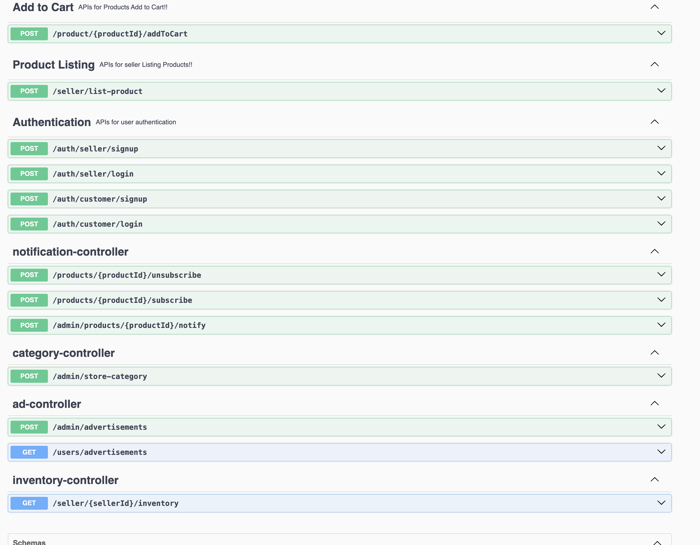
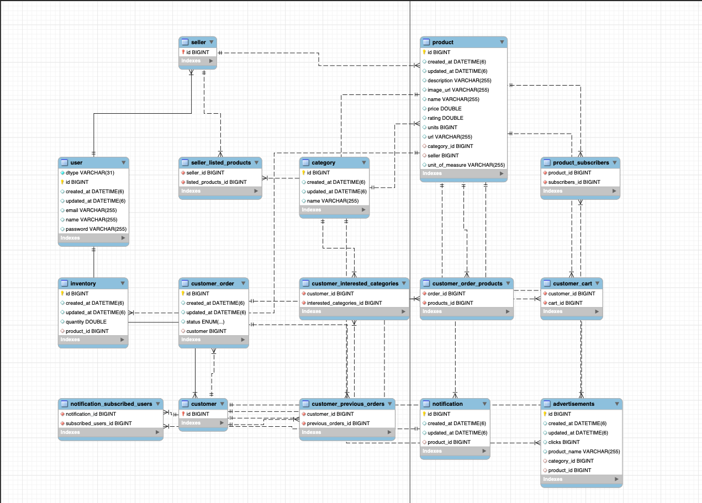

## ECOMMERCE

#### Step - 0

- Do you want a complete booking system[correct]? or Entites?
- How user interacts with the system? commandline/ rest api[correct]?
- Do you want to persist data in memory or Actual DB[correct].

#### Step -1

##### User journey
- User -> LOGIN -> Choose Product -> Add to Cart -> Checkout(Summary) -> Payment -> Payment Confirmation -> Order History
- Ads -> User Specific Data
- Seller -> list product -> update inventory
- show inventory for a seller.
##### Requirements
- 

##### API Endpoints
- login(email,pwd):Response status [Done]
- signup(name,email,pwd):Response status [Done]
- getAllProducts():List<Products>
- getProductsForType(ptype):List<Products>
- listProduct(product):Response Status [Done]
- getInventory(sellid):List<productsInventory> [Done]
- addToCart(pid,quantity):Response Status [Done]
- showAds(uid):List<Products>[Done]
- processPayment(uid,amount):Response+tranx id 
  - factory method
- notifyProductStockStatus(List<uid>):[Done]
  - observer pattern.[Incomplete]
- 

#### Step -2 Class Diagram
```commandline
+----------------+           +------------------+
|     User       |           |     Category     |
+----------------+           +------------------+
| - userId       |           | - categoryId     |
| - name         |           | - name           |
| - email        |           +------------------+
| - password     |
+----------------+
       ▲
       |
+--------------+
|   Buyer      |
+--------------+        +----------------------+
| - buyerId    |------->| interestedCategories |
| - cart       |        +----------------------+
| - orders     |
+--------------+
       |
       v
+--------------+
|   Order      |
+--------------+
| - orderId    |
| - products   |
| - status     |
+--------------+

+--------------+          +----------------+
|   Product    |<-------->|   Seller       |
+--------------+          +----------------+
| - productId  |          | - sellerId     |
| - name       |          | - products     |
| - price      |          +----------------+
| - stock      |
| - category   |
+--------------+

+----------------+        +-------------------------+
|  Inventory     |        |    Notification         |
+----------------+        +-------------------------+
| - product      |<-------| - product               |
| - quantity     |        | - subscribedUsers       |
+----------------+        +-------------------------+

+------------------+
| Advertisement    |
+------------------+
| - adId           |
| - product        |
| - category       |
| - link           |
+------------------+

```

#### Step -3 Schema/ER Diagram

### Development Issues and Resolutions
##### Issue - 1 
- Application shutsdown once schema created
  - Resolution: In your new app, you're probably missing at least one of these:
  - No spring-boot-starter-web dependency, so no embedded server. 
  - No REST controllers or active @RequestMapping endpoints. 
  - No non-daemon thread like CommandLineRunner to keep it alive.
  - You're unintentionally treating it as a CLI app, which starts and exits.
  - Solution: add spring-boot-starter-web in Pom for default tomcat server.