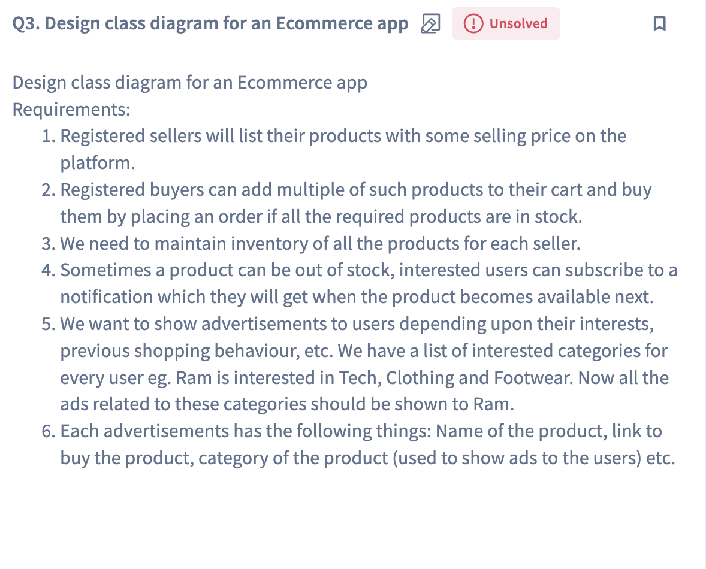

## ECOMMERCE

#### Step - 0

- Do you want a complete booking system[correct]? or Entites?
- How user interacts with the system? commandline/ rest api[correct]?
- Do you want to persist data in memory or Actual DB[correct].

#### Step -1

##### User journey
- User -> LOGIN -> Choose Product -> Add to Cart -> Checkout(Summary) -> Payment -> Payment Confirmation -> Order History
- Ads -> User Specific Data
- Seller -> list product -> update inventory
- show inventory for a seller.
##### Requirements
- 

##### API Endpoints
- login(email,pwd):Response status [Done]
- signup(name,email,pwd):Response status [Done]
- getAllProducts():List<Products>
- getProductsForType(ptype):List<Products>
- listProduct(product):Response Status [Done]
- getInventory(sellid):List<productsInventory> [Done]
- addToCart(pid,quantity):Response Status
- showAds(uid):List<Products>
- processPayment(uid,amount):Response+tranx id
  - factory method
- notifyProductStockStatus(List<uid>):
  - observer pattern.

#### Step -2 Class Diagram

#### Step -3 Schema/ER Diagram

### Development Issues and Resolutions
##### Issue - 1 
- Application shutsdown once schema created
  - Resolution: In your new app, you're probably missing at least one of these:
  - No spring-boot-starter-web dependency, so no embedded server. 
  - No REST controllers or active @RequestMapping endpoints. 
  - No non-daemon thread like CommandLineRunner to keep it alive.
  - You're unintentionally treating it as a CLI app, which starts and exits.
  - Solution: add spring-boot-starter-web in Pom for default tomcat server.